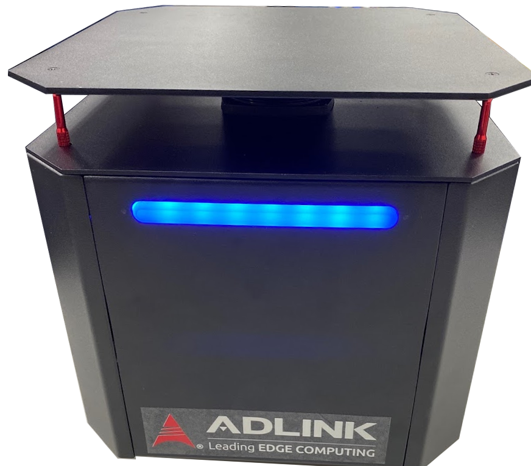

NeuronBot2 is the main task of mine as an intern. It is the latest version of NeuronBot made by ADLINK, which fully supports ROS1 and ROS2. 

From this project, I learned about how a project is processed, how to negotiate and cooperate with other companies, and, of course, leveled up my coding skill. 

Appreciate all my colleagues in ARPG of ADLINK.

See the project in [Github](https://github.com/Adlink-ROS/neuronbot2/tree/eloquent-devel) .